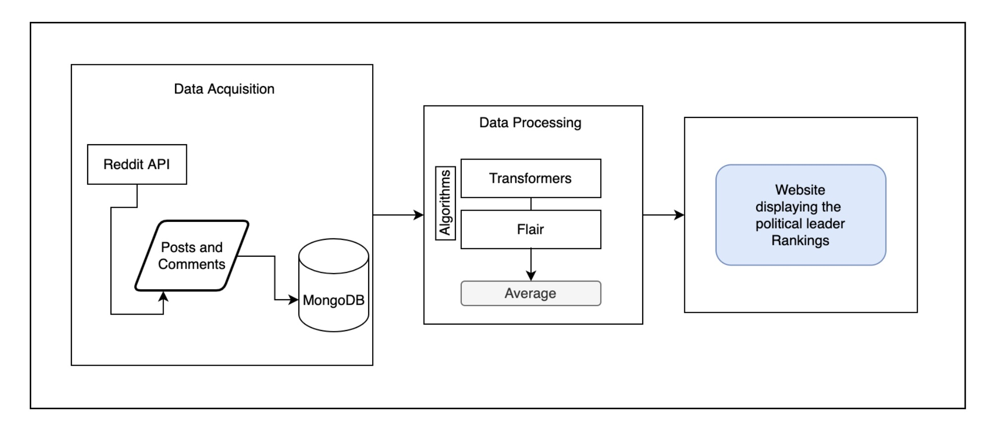
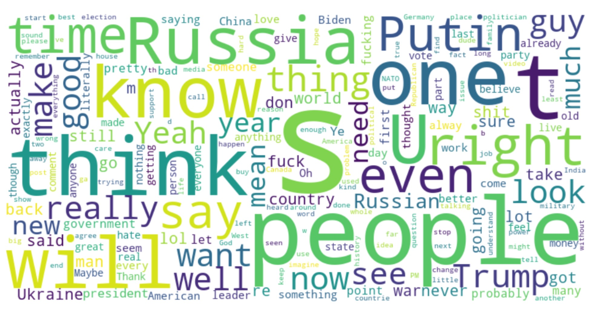
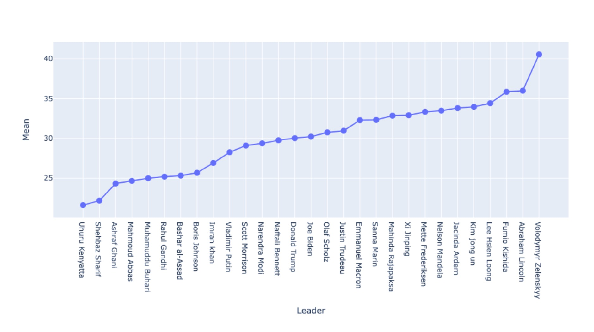

# Political Likeability - Hybrid Perception Analysis of World Leaders 🌍

[](https://www.python.org/downloads/)
[](https://pytorch.org/)
[](https://www.nltk.org/)
[](https://www.mongodb.com/)
[](https://www.reddit.com/dev/api/)

**📊 Analyzing public perception of world leaders on social media platforms by building a dataset of user posts and comments and categorizing them into positive, negative and neutral opinions using sentiment analysis by employing Large Language Models.**

An objective ranking system for world leaders based on sentiment analysis of anonymous Reddit comments using state-of-the-art NLP algorithms.

## 📋 Abstract

With the increasing popularity of social media and the number of hours spent on social media growing rapidly, people share their opinion on a wide range of topics and issues. By extracting user comments on top posts about political leaders on Reddit, we rank them based on their likeability using various ML algorithms. 

Machine learning in social media analysis is essential as it's impossible to classify all data manually. Sentiment Analysis is a natural language processing technique used to determine whether data is positive, negative or neutral. We apply NLP algorithms such as Flair, Transformers using PyTorch, NLTK and combine them to get better predictive performance. This research ranks various political leaders with results from multiple NLP algorithms, serving as objective research gathered from completely anonymous users on Reddit.

## 🎯 Why Reddit?

**"Give a man a mask and he'll show you his true face"**

- **Complete Anonymity**: Users share genuine opinions without fear of judgment
- **No Popularity Bias**: Unlike Twitter's verified accounts and follower hierarchies  
- **430M+ Active Users**: Larger user base than competitors like Twitter (217M)
- **Unfiltered Discussions**: Extensive daily discussions on various political topics
- **True Public Opinion**: Anonymous platform reveals authentic sentiments

## ✨ Key Features

### 🔍 Data Collection
- **Reddit API Integration**: Automated bot using PRAW (Python Reddit API Wrapper)
- **Smart Filtering**: Extracts top 10 posts per leader based on Reddit's ranking algorithms
- **Comprehensive Dataset**: 57,000+ comments across 30 world leaders
- **Multi-language Filtering**: Automatically filters non-English comments

### 🧠 Advanced NLP Processing
- **Multiple Model Ensemble**: Combines results from state-of-the-art algorithms
- **Preprocessing Pipeline**: Removes deleted comments, emojis, and irrelevant data
- **Language Detection**: Filters dataset to English-only content
- **Error Handling**: Comprehensive data cleaning and validation

### 📊 Sentiment Analysis Models
- **Flair Sentiment Analysis**: PyTorch-based contextual string embeddings
- **DistilBERT**: Transformer-based bidirectional encoder representations  
- **TextBlob Analysis**: Word-weight dictionary approach for polarity scoring
- **NLTK Integration**: Advanced tokenization and preprocessing

## 🏗️ System Architecture


*Figure 1: Steps involved in the perception analysis of world leaders*

### Data Flow Process
1. **Data Acquisition**: Reddit bot collects top posts and comments
2. **Storage**: MongoDB cloud database for scalable data management
3. **Preprocessing**: Data cleaning, language filtering, error removal
4. **Analysis**: Multiple NLP algorithms process the cleaned dataset
5. **Ranking**: Combined results generate final leader rankings

## 📈 Latest Results (April 2022)

### Top 10 World Leaders by Public Sentiment

| Rank | Country | Leader | DistilBERT | Flair | Mean Score |
|------|---------|--------|------------|-------|------------|
| 🥇 1 | Ukraine | Volodymyr Zelenskyy | 38.634 | 42.470 | **40.552** |
| 🥈 2 | USA | Abraham Lincoln | 34.545 | 37.435 | **35.990** |
| 🥉 3 | Japan | Fumio Kishida | 35.697 | 35.995 | **35.846** |
| 4 | Singapore | Lee Hsien Loong | 31.223 | 37.621 | **34.422** |
| 5 | North Korea | Kim Jong Un | 31.171 | 36.773 | **33.972** |
| 6 | New Zealand | Jacinda Ardern | 31.977 | 35.648 | **33.812** |
| 7 | South Africa | Nelson Mandela | 31.827 | 35.148 | **33.487** |
| 8 | Denmark | Mette Frederiksen | 32.143 | 34.524 | **33.333** |
| 9 | China | Xi Jinping | 33.075 | 32.749 | **32.912** |
| 10 | Sri Lanka | Mahinda Rajapaksa | 31.609 | 34.097 | **32.853** |


*Figure 2: Most commonly used words from the dataset*


*Figure 3: Line graph displaying the growth in positive comments*

## 🛠️ Tech Stack

### Core Technologies
- **Backend**: Python 3.8+
- **Database**: MongoDB (Cloud-hosted)
- **APIs**: Reddit API with PRAW wrapper
- **ML Frameworks**: PyTorch, TensorFlow, scikit-learn

### NLP Libraries
- **Transformers**: Hugging Face Transformers library
- **Flair**: PyTorch-based NLP framework
- **NLTK**: Natural Language Toolkit
- **TextBlob**: Simplified text processing

### Data Processing
- **Pandas**: Data manipulation and analysis
- **NumPy**: Numerical computing
- **Matplotlib/Seaborn**: Data visualization
- **Jupyter**: Interactive development environment

## 🚀 Quick Start

### Prerequisites
- Python 3.8+
- MongoDB account
- Reddit API credentials

## 📊 Usage

### Data Collection
```python
from CommentScraper import RedditScraper

# Initialize scraper
scraper = RedditScraper()

# Collect comments for specific leaders
leaders = ['biden', 'modi', 'putin', 'trudeau']
scraper.collect_comments(leaders, num_posts=10)
```

### Sentiment Analysis
```python
from sentiment_analyzer import SentimentAnalyzer

# Initialize analyzer with multiple models
analyzer = SentimentAnalyzer(['flair', 'distilbert', 'textblob'])

# Analyze comments
results = analyzer.analyze_dataset()
rankings = analyzer.generate_rankings()
```

## 🔍 Key Insights

### Data Analysis Findings
- **Western Bias**: More comments about Western leaders due to Reddit's English-speaking user base
- **Negative Tendency**: Online forums tend toward satirical, argumentative, and generally negative interactions
- **Model Consistency**: Flair and DistilBERT showed highest accuracy and consistency
- **Transformer Superiority**: Transformer-based models significantly outperformed traditional approaches

### Performance Comparison

| Model | Time (CPU) | Time (GPU) | Accuracy |
|-------|------------|------------|----------|
| TextBlob | 5.23 min | 4 min | Baseline |
| Flair | 53.35 min | 9.53 min | High |
| DistilBERT | 36.18 min | 8.4 min | High |

## 🚀 Future Enhancements

### Short-term Goals
- **Real-time Analysis**: Live sentiment tracking during major political events
- **Multi-language Support**: Extend analysis to non-English comments
- **Temporal Analysis**: Track sentiment changes over time periods

### Long-term Vision
- **Election Prediction**: Use sentiment trends to predict electoral outcomes
- **Cross-platform Analysis**: Integrate Twitter, Facebook, and other social platforms
- **Psychological Research**: Analyze human behavior patterns in anonymous settings
- **Interactive Dashboard**: Real-time web interface for sentiment visualization

### Research Applications
- **Political Campaign Strategy**: Help campaigns understand public perception
- **Media Analysis**: Track how news events affect leader popularity
- **Comparative Politics**: Study cultural differences in political sentiment
- **Academic Research**: Provide datasets for political science studies

## 📚 Research & Publications

This work has been published as:
> V. R. Sekar, T. K. R. Kannan, S. N and Priya Vijay, "Hybrid Perception Analysis of World Leaders in Reddit using Sentiment Analysis," 2023 International Conference on Advances in Intelligent Computing and Applications (AICAPS), Kochi, India, 2023

**📖 [Read the full paper - IEEE Xplore](https://doi.org/10.1109/AICAPS57044.2023.10074005)**

## 🤝 Contributing

Contributions are welcome! Areas for contribution:
- Adding new sentiment analysis models
- Improving data preprocessing pipeline
- Extending to other social media platforms
- Enhancing visualization capabilities

1. Fork the repository
2. Create your feature branch (`git checkout -b feature/AmazingFeature`)
3. Commit your changes (`git commit -m 'Add some AmazingFeature'`)
4. Push to the branch (`git push origin feature/AmazingFeature`)
5. Open a Pull Request

## 📄 License

This project is licensed under the MIT License - see the [LICENSE](LICENSE) file for details.

## ⚠️ Ethical Considerations

- All data collection follows Reddit's API terms of service
- User anonymity is preserved throughout the analysis
- Results represent snapshot opinions and may change over time
- This research is for academic and educational purposes only
